[](https://github.com/gethubryma/etl-dataops-postgresql/actions/workflows/ci.yml)

# TP DataOps ETL — pandas + PostgreSQL + pytest + GitHub Actions

## Réalisé par

* DRISS Ryma

---

# Introduction

Ce TP a pour objectif de réaliser un pipeline ETL DataOps complet utilisant :

* Python
* pandas
* PostgreSQL
* Docker
* pytest
* GitHub Actions

Le pipeline suit l’architecture :

```text
Extract -> Transform -> Load
```

Le projet inclut également :

* des tests unitaires
* des tests d’intégration
* l’automatisation CI/CD avec GitHub Actions
* un bonus de couverture de tests supérieur à 80%

---

# Structure du projet

Le projet a été organisé selon l’arborescence suivante :

```text
NOM_PRENOM/
│
├── src/
│   ├── extract.py
│   ├── transform.py
│   ├── load.py
│   ├── run.py
│   └── __init__.py
│
├── data/
│   └── ventes.csv
│
├── tests/
│   ├── conftest.py
│   ├── test_transforms.py
│   └── test_load.py
│
├── .github/workflows/
│   └── ci.yml
│
├── docker-compose.yml
├── requirements.txt
├── README.md
└── .gitignore
```

---

# Création et lancement de PostgreSQL avec Docker

## Création du fichier docker-compose.yml

Le fichier `docker-compose.yml` a été créé afin de lancer PostgreSQL comme entrepôt de données.

Le conteneur utilise :

* image : postgres:15
* base : warehouse
* utilisateur : etl_user
* mot de passe : etl_secret

## Lancement du conteneur Docker


```bash
docker compose up -d
docker ps
```


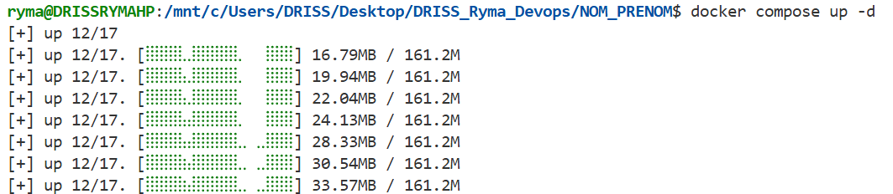
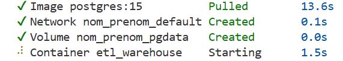
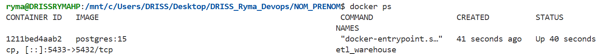

---

# Vérification de PostgreSQL
Une connexion à PostgreSQL a été effectuée depuis le conteneur Docker.


```bash
docker exec -it etl_warehouse psql -U etl_user -d warehouse
```

Les bases suivantes ont été affichées :

* postgres
* template0
* template1
* warehouse

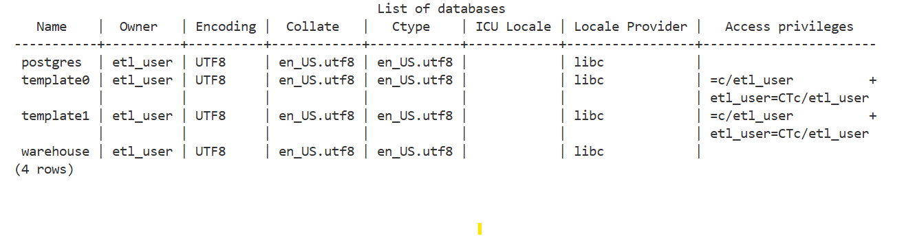

---

# Création du fichier source CSV

Le fichier `data/ventes.csv` contient les données de ventes fournies dans le sujet.

Le dataset contient :

* un email vide
* un montant négatif

Ces données invalides doivent être supprimées durant la phase de transformation.

---

# Implémentation de extract.py

Le fichier `extract.py` contient la fonction :

```python
extract(csv_path)
```

Cette fonction :

* lit le fichier CSV
* retourne un DataFrame pandas brut

Exemple d’utilisation :

```python
from src.extract import extract

df = extract("data/ventes.csv")
print(df.head())
```

## Résultat obtenu

* 10 lignes ont été lues depuis le fichier CSV.

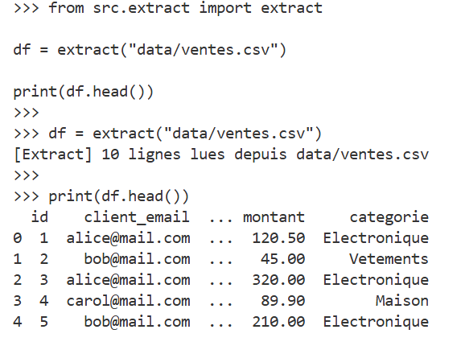

---

# Implémentation de transform.py

Le fichier `transform.py` contient toutes les transformations pandas.

## Fonction clean(df)

La fonction `clean(df)` réalise :

* conversion des types
* nettoyage des emails
* suppression des valeurs invalides
* suppression des montants négatifs
* suppression des dates invalides

Les emails sont convertis en minuscules.

Les lignes invalides sont supprimées.

## Résultat obtenu

Après nettoyage :

* 8 lignes valides restent
* 2 lignes invalides sont supprimées

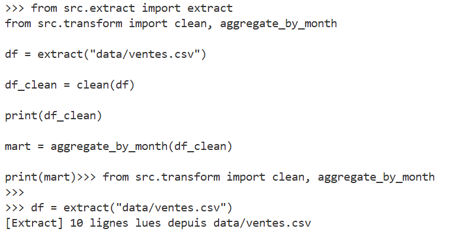
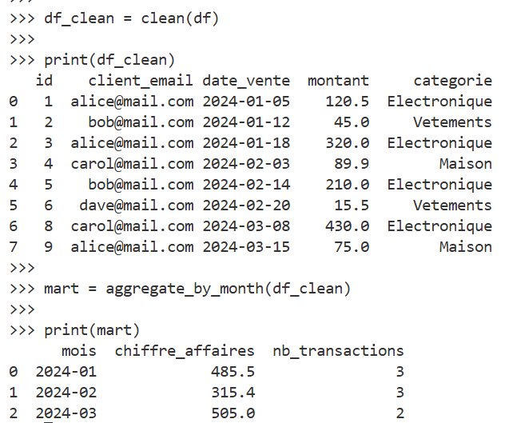


## Fonction aggregate_by_month(df)

Cette fonction réalise une agrégation mensuelle du chiffre d’affaires.

Elle calcule :

* le chiffre d’affaires mensuel
* le nombre de transactions par mois

## Résultat obtenu

| Mois    | Chiffre d’affaires | Transactions |
| ------- | ------------------ | ------------ |
| 2024-01 | 485.5              | 3            |
| 2024-02 | 315.4              | 3            |
| 2024-03 | 505.0              | 2            |


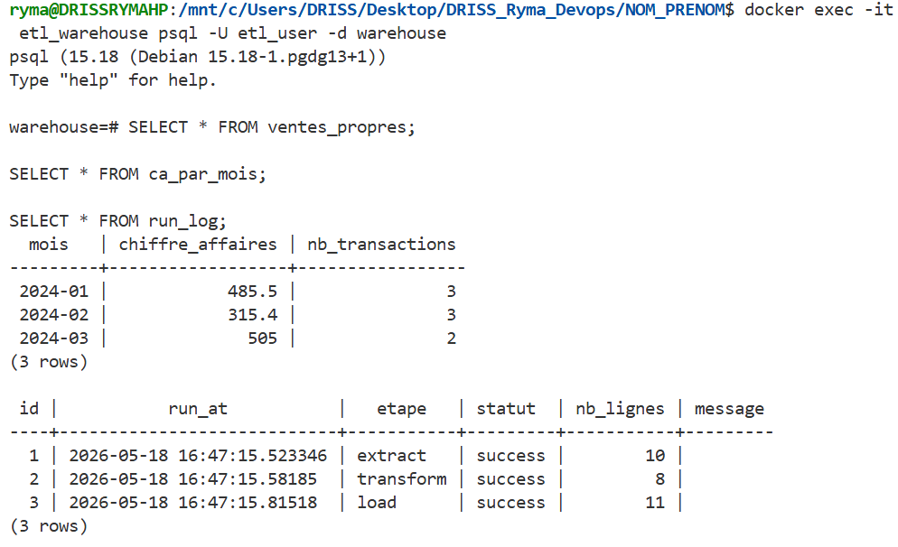


## Bonus - aggregate_by_category(df)

Cette fonction calcule :

* le chiffre d’affaires par catégorie
* le nombre de transactions par catégorie

---

# Implémentation de load.py

Le fichier `load.py` contient les fonctions de chargement PostgreSQL.

Les tables suivantes sont créées automatiquement :

* ventes_propres
* ca_par_mois
* run_log

Les DataFrames pandas sont chargés dans PostgreSQL avec :

```python
df.to_sql()
```

La table `run_log` enregistre :

* l’étape exécutée
* le statut
* le nombre de lignes
* les erreurs éventuelles

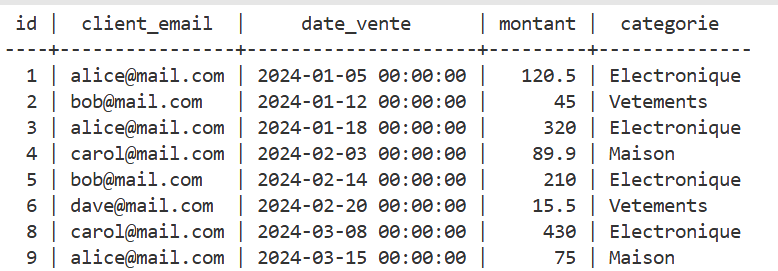

---

# Implémentation de run.py

Le fichier `run.py` orchestre tout le pipeline ETL.

Ordre d’exécution :

```text
Extract -> Transform -> Load
```

## Étapes exécutées

### Étape 1 - Extract

Lecture du CSV.

### Étape 2 - Transform

Nettoyage pandas et agrégation.

### Étape 3 - Load

Chargement des données dans PostgreSQL.

## Résultat obtenu

Le pipeline s’exécute avec succès.

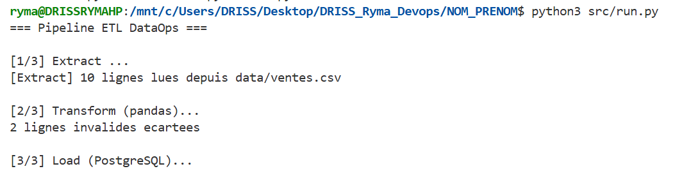


---

# Tests unitaires avec pytest

Fichier :

```text
tests/test_transforms.py
```
Les tests unitaires vérifient les transformations pandas.
Les tests vérifient :

* suppression des emails vides
* suppression des montants négatifs
* conversion des types
* agrégation mensuelle
* agrégation par catégorie

## Résultat obtenu

Tous les tests passent avec succès.

```text
20 PASSED
```

# Tests d’intégration PostgreSQL

Les tests d’intégration vérifient :

* le chargement dans PostgreSQL
* le contenu des tables
* les contraintes métier

Fichier :

```text
tests/test_load.py
```

Les requêtes SQL sont utilisées pour vérifier :

* le nombre de lignes
* l’absence de montants négatifs
* l’absence d’emails vides

---

# Couverture des tests

```bash
pytest --cov=src.transform --cov=src.load --cov-report=term-missing
```

## Résultat obtenu

```text
TOTAL 90%
```

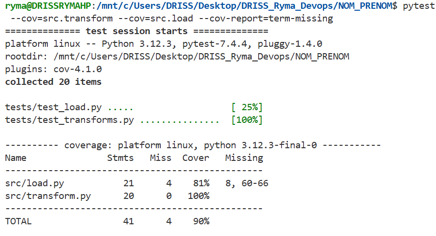

---

# GitHub Actions — CI/CD

Le workflow CI a été créé dans :

```text
.github/workflows/ci.yml
```
### Tests pytest

```bash
pytest -v
```

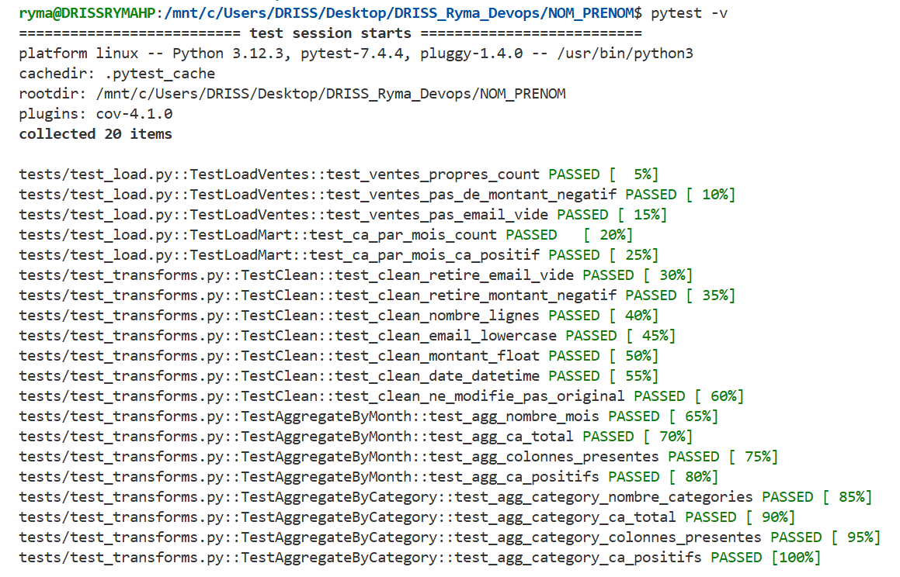

Le workflow automatise :

* installation des dépendances
* lancement PostgreSQL
* tests unitaires
* tests d’intégration
* couverture des tests

### Résultat obtenu

Le workflow GitHub Actions s’exécute avec succès.

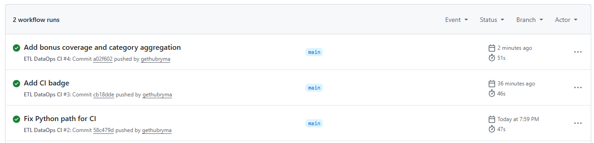
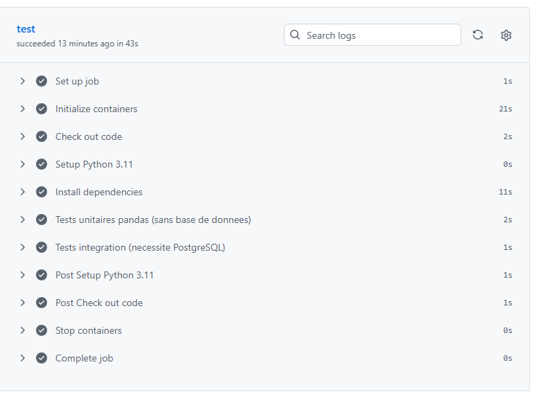


Le badge CI a été ajouté dans le README.
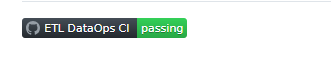


## Exécution du pipeline

```bash
python3 src/run.py
```
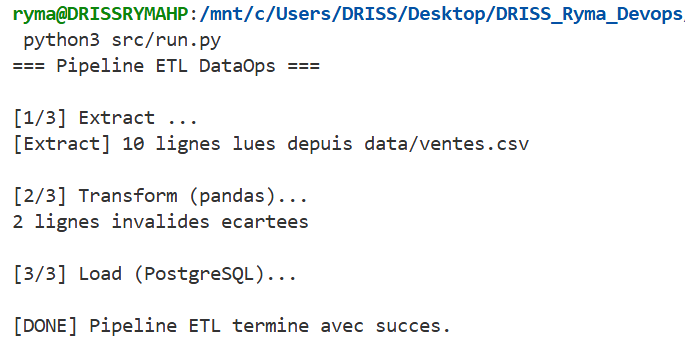
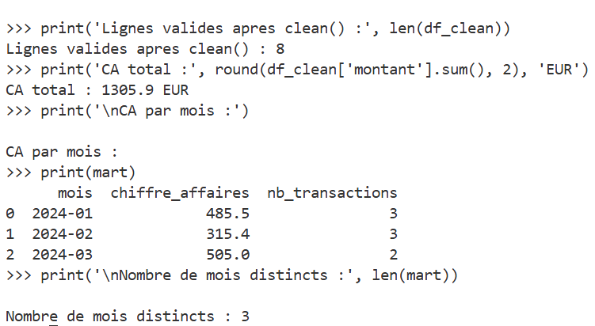
#  Conclusion

Ce TP a permis de mettre en œuvre un pipeline ETL DataOps complet utilisant pandas, PostgreSQL, Docker, pytest et GitHub Actions.

Les objectifs suivants ont été atteints :

* extraction des données CSV
* nettoyage pandas
* agrégation analytique
* chargement PostgreSQL
* tests unitaires
* tests d’intégration
* automatisation CI/CD
* couverture de tests 90%

Le pipeline ETL développé fonctionne correctement et toutes les étapes ont été validées par les tests.


